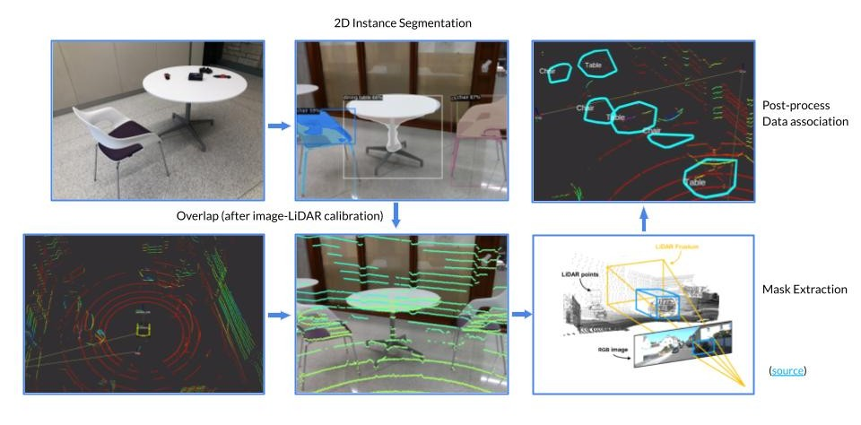
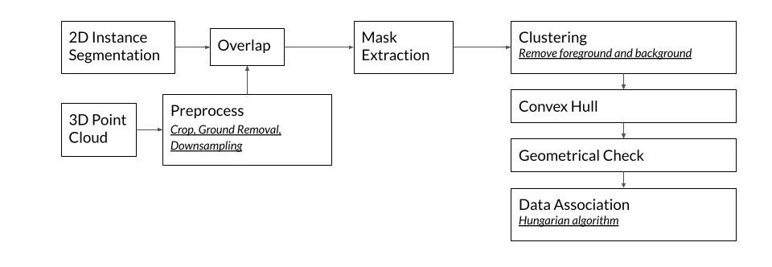

_Skills - ROS, C++, Detectron2, LiDAR, PCL, PyTorch, CUDA, Instance Segmentation, Image-LiDAR Fusion, SLAM, Computer Networking_

## Overview

As COVID-19 spreads across the world, disinfecting surfaces regularly is important for reducing the spread of the infectious disease. An autonomous robot can operate such no-touch disinfection with less operating cost and minimize the risk for people.

This project built a full-stack disinfection robot with perception, localization, mapping, and navigation capability. The robot can classify and localize tables/desks/chairs in an indoor environment, as well as detect and track people in 3D. After a table/desk/chair being used by a human, the robot will approach the table/desk/chair to do the disinfection.



## Hardware

- Jackal mobile robot platform from Clearpath
- RGB-D camera from Intel Realsense (only the RGB camera is used in the final version)
- VLP-16 LiDAR from Velodyne

The RGB-D camera is mounted at shoulder height by an Aluminum extrusion. The final version of the perception module's inputs are RGB images from the Realsense camera and 3D point cloud from Velodyne LiDAR.

## Software

The diagram below shows the high-level overview of the software stack with inputs and outputs for each sub-system.

The operation pipeline includes three stages.

**Stage 1 - SLAM:** In this stage, manually driving the robot around builds a map of its surrounding environment. The map includes a 2D occupancy grid and a pose graph for localization in later stages.

**Stage 2 - Object-level Map Building:**  In the second stage, the robot localizes itself in the environment in real-time. It moves around to detect and classify all the tables and chairs in the environment using an image-LiDAR fusion-based approach. Objects are detected and segmented by Mask R-CNN. Detectron2 object detection and segmentation framework was used, and the model was pre-trained on the COCO dataset. With an extrinsic calibration between the camera and the 3D LiDAR, the 3D point cloud can be projected onto the image plane and overlap with the image. The point cloud inside each mask can then be extracted. Because there will be foreground and background points getting included, clustering algorithms were used for post-processing.

Each object is represented as a 2D convex hull. Because each time, the robot can only look at an object from one direction, which gives an incomplete representation of the object, a Hungarian algorithm is also implemented for data association ([`object_map_server`](https://github.com/shangzhouye/disinfection-robot-ros/blob/master/rgbd_object_detection/src/object_map_server.py)) running in the backend. When two convex hulls are associated, which means they represent the same object, they will get merged into a large convex hull so that by looking at the same object from different directions, a complete representation for each object can be obtained. After this stage, an object-level map representing all the tables and chairs in the environment is built.

**Stage 3 - People Detection:** This module detects and tracks people with a Kalman filter. The [`object_map_server`](https://github.com/shangzhouye/disinfection-robot-ros/blob/master/rgbd_object_detection/src/object_map_server.py) then detects which tables/chairs have been used and need disinfection. When a table is being used, it turns green in the visualization. When it passes a certain threshold, the convex hull permanently turns yellow with a 'need disinfection' tag.

The images below show a detailed pipeline of the image-LiDAR fusion algorithm.

## Inference in the cloud

The software stack has the computation done both at the edge and 'in the cloud.' Because there is no GPU on the robot, a local network is set up between three Linux machines: the robot, the GPU computer in the lab, and my laptop for visualization. Nodes are split onto the onboard computer (Jackal robot) and the cloud GPU computer (the Beast computer). Image data is getting transferred onto the GPU computer wirelessly under the ROS framework for deep learning inference, and then and results are sent to my laptop for visualization.

The diagram below shows which node is running on which computer.

For hostname resolution details and the ROS setup to perform this hybrid computing, please refer to this [README](https://github.com/shangzhouye/disinfection-robot-ros/blob/master/README.md/#setup-documentation). Inference in the cloud (with a GeForce GTX 1080Ti) is able to achieve a 6Hz frame rate.