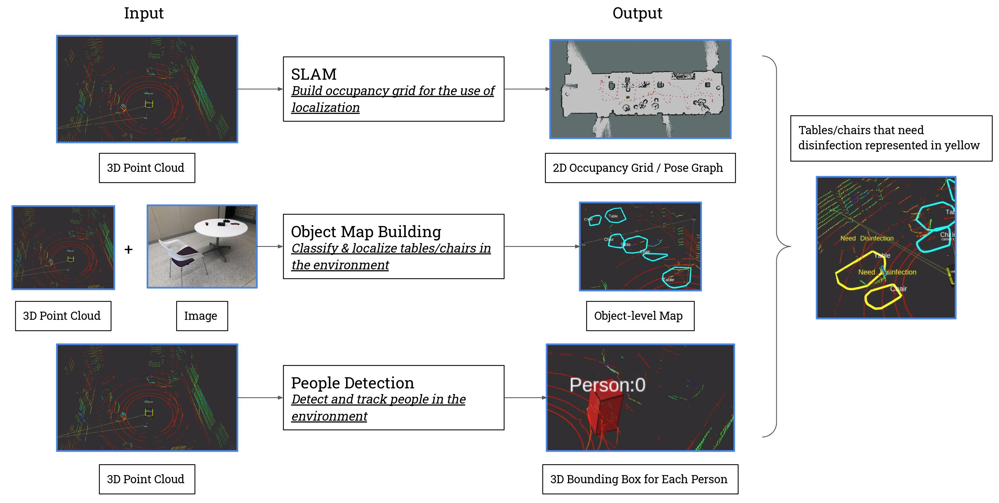

_Skills - ROS, C++, Detectron2, Instance Segmentation, Image-LiDAR Fusion, SLAM_

## Demo



## Overview

As COVID-19 spreads across the world, disinfecting surfaces on a regular basis is important for reducing the spread of the infectious disease. An autonomous robot can operate such no-touch disinfection with less operating cost, and minimize the risk for people. 

In this project, I built a full-stack disinfection robot with perception, localization, mapping, and navigation capability. The robot is able to classify and localize tables/desks/chairs, as well as to detect and track people in an indoor environment. After a table/desk/chair being used by a human, the robot will approach the table/desk/chair to do the disinfection.

### Hardware

- Jackal robot from Clearpath
- RGB-D camera from Intel Realsense (only the RGB camera is used in the final version)
- VLP-16 LiDAR from Velodyne

### Software

The diagram below shows the high-level overview of the software stack with inputs and outputs for each sub-system.

The operation pipeline includes three stages.

**Stage 1 - SLAM:** This module builds the 2D occupancy grid and a pose graph for the use of localization in later stages.

**Stage 2 - Object-level Map Building:** Move the robot to each object, the map building module will classify and localize all the tables/chairs/desks using an image-LiDAR fusion-based approach. Objects are detected and segmented by Mask R-CNN. With an extrinsic calibration between the camera and the 3D LiDAR, the point cloud inside each mask can then be extracted and processed. Each object is represented as a 2D convex hull. A [`object_map_server`](https://github.com/shangzhouye/disinfection-robot-ros/blob/master/rgbd_object_detection/src/object_map_server.py) node is running in the background to do data associations between frames.

**Stage 3 - People Detection:** This module detects and tracks people with a Kalman filter. The [`object_map_server`](https://github.com/shangzhouye/disinfection-robot-ros/blob/master/rgbd_object_detection/src/object_map_server.py) then detects which tables/chairs have been used and need disinfection.

Implementation details of each sub-system is described in the [Algorithms](#algorithms) section.

## Inference in the cloud

The software stack has the computation done both at the edge and in the cloud. It splits nodes onto the onboard computer (Jackal robot), and the cloud GPU computer (the Beast computer). With SLAM & localization nodes, etc. running on the robot, computer vision & detection nodes running on the GPU computer, and wireless data transmission between them, the system is able to achieve real-time performance without an onboard GPU. 

The diagram below shows which node is running on which computer. My laptop is only used for visualization purpose.

For hostname resolution details and ROS setup to perform this hybrid computing, please refer to this README. Inference in the cloud (with a GeForce GTX 1080Ti) is able to achieve 6Hz frame rate.

## Algorithms

Details coming up soon.