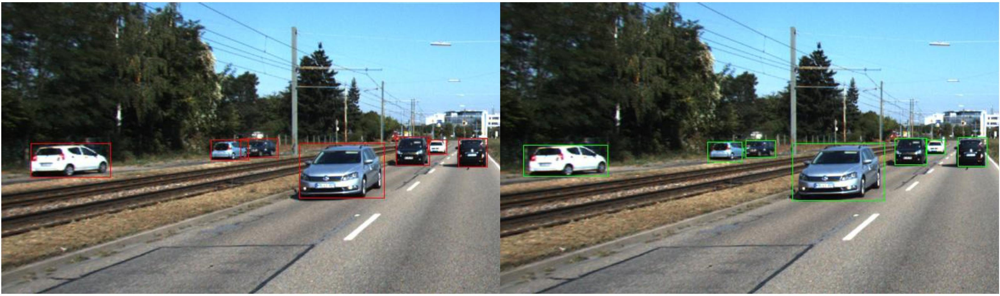

*Skills: PyTorch, GPU, Deep Learning, Keypoint Estimation, Focal Loss, Evaluation Metric*

## Overview

This project implemented CenterNet \[1] from scratch for 2D object detection and tested on [KITTI dataset](http://www.cvlibs.net/datasets/kitti/eval_object.php?obj_benchmark=2d).

### Example Output

> *Bounding box detection result of an image in the KITTI dataset*

> *Predicted heatmap of object center points on an image from the validation set.*

We aimed to reproduce the results as what is presented in the original [CenterNet](https://arxiv.org/pdf/1904.07850.pdf) paper. The model represents each object as a single point - the center point of the 2D bounding box. DLA-34 \[2] is used as our backbone for center point estimation, and other object properties including width and length of the bounding box are regressed from the center point. We achieved 92.10% Average Precision (AP) for easy objects, 86.72% AP for moderate objects and 78.73% AP for hard objects respectively when detecting cars.

My contribution includes implementing the training & validation loop from scratch, hyper-parameter tuning, and inference & testing on the KITTI dataset using average precision metric.

- [Overview](#overview)
  - [Example Output](#example-output)
- [Network Design](#network-design)
- [Training and Testing](#training-and-testing)
- [Results](#results)
- [Future Work](#future-work)
- [Acknowledgement](#acknowledgement)
- [Reference](#reference)

## Network Design

The CenterNet framework \[1] models the object as a single point, which is the center of the bounding box in the image. CenterNet first uses keypoint estimation to find center points. The image is fed into a fully-convolutional encoder-decoder network, and the output is a heatmap for each class with values between \[0,1]. Peaks in the heatmap correspond to object centers. In our project, we use a [DLA-34](https://arxiv.org/pdf/1707.06484.pdf) network \[2] as the backbone for our keypoint estimation system. For our training, the input is the KITTI data set image resized to 512 x 512 pixels. We then calculate the center position *p* of the car objects in the resized image space from the label data, and generate the ground truth heatmap by passing the center keypoint through a Gaussian smoothing kernel, where the intensity value of each pixel $I(x,y) = exp(\frac{-(x - p_x)^2 + (y - p_y)^2)}{2\sigma_p^2})$ ($\sigma_p$ is adaptive to the object size). A pixel-wise maximum is taken should two Gaussians overlap. A penalty-reduced pixel-wise logistic regression with focal loss is then used for the training.

$N$ is the number of keypoints, and $\alpha, \beta$ are hyper-parameters for the focal loss \[6].

Once the keypoint detection heatmap is generated, other properties, such as the bounding box of the object, are then regressed from the image features at the center location. The regression shares the same fully-convolutional backbone  with  the  keypoint  estimator with a separate regression head for each property. The loss function for the regression is the L2 loss between the predicted size of the bounding box and the ground truth size of the  bounding box. The architecture of our network is shown in Figure 1.

> *Figure 1: Network architecture with three heads - heatmap head, offset head and width-height head.*

**Implementation details:** We use the 34-layer deep layer aggregation (DLA) network \[2] as our backbone. The heatmap from the keypoint estimator has the size of 128 x 128 with an output stride of 4. There is an additional local offset prediction to compensate for the decrease in resolution. The weights of heatmap loss, width/height loss and offset loss are 1, 0.1, and 0.1 respectively. We trained with batch-size of 8 (on 1 GPU) and learning rate of 5e-4. The model converges after 3 epochs and start to over-fitting after that.

## Training and Testing

We use the KITTI \[7] Vision Benchmark Suite. It consists of 7481 training images and 7518 test images, comprising a total of 80256 labeled objects. For this project, we focus on object detection for cars only. Because only those 7481 training images have publicly available labels, we random split them into training and validation sets. The training set is 80% of the whole dataset (5984 images) while the validation is 20% of the whole dataset (1497 images). No data augmentation is utilized for our project.

For the evaluation, we followed the standard average precision (AP) evaluation criteria proposed in the Pascal VOC benchmark \[8]. A car detection can be counted as true positive only if its overlap with the ground truth bounding box is above 70%. By adjusting the confidence threshold for detection, a precision-recall (PR) curve can be obtained with 40 different recall positions. The AP can then be calculated as the area under the PR curve. We use this calculated average precision value as the measure of the performance of our system. The KITTI benchmark evaluation criterion has three levels of difficulty: Easy, Medium, and Hard  \[7]. The object's minimum bounding box height decreases with increasing difficulty, while the maximum occlusion level and maximum truncation increases with increasing difficulty.

The training loop and inferences steps can be described in Figure 2.

> *Figure 2: Training and Inference flowchart ([source](https://medium.com/visionwizard/centernet-objects-as-points-a-comprehensive-guide-2ed9993c48bc)).*

## Results

> *Table 1: Compare evaluation results of our implementation to the original CenterNet on KITTI.*

Table 1 shows our evaluation results compared to the original CenterNet paper. Notice that the original paper follows a 50/50 training and validation split and we are having an 80/20 split. Also, the results of the original paper is based on all classes but we only focused on cars predictions in this project.

> *Figure 3: An example image in the validation set. (left) Ground truth (right) inference results from our implementation.*

> *Figure 4: (left) Ground truth (right) Predicted heatmap. (bottom) Inference results.*

Figure 3 shows an example inference result compared to the ground truth. It is shown that our model to able to predict most of the objects correctly in this scene. Figure 4 shows the comparison between the ground truth heatmap with Gaussian smoothing and our predicted heatmap on the same image.

> *Figure 5: Precision Recall curve on validation set.*

Figure 5 shows the precision-recall curve of our final model on the validation set. Three curves represent easy, moderate, and hard objects respectively. The area under the curve is the average precision (AP).

## Future Work

One of the main advantages of the CenterNet architecture is that it can be very easily extended to other tasks, such as 3D detection, as well as human pose estimation, with minor effort. Once the heat map for center detection is obtained, more properties of the image can be learned simply by changing the regression head of the model. It would be very interesting to see how the model performs when detecting 3D location of cars without any explicit depth measurement like LiDAR. Due to the short time frame of this project, we are unable to get to the point of doing 3D detection, but it is certainly an intriguing direction to take further on.

## Acknowledgement

This project is the teamwork of me and Tianfu as the final project of CS 496 Deep Learning, Fall 2020, Northwestern University.

## Reference

\[1] X. Zhou, D. Wang, and P. Krahenb, “Objects as points,” in arXiv preprint arXiv:1904.07850, 2019.

\[2] F. Yu, D. Wang, E. Shelhamer, and T. Darrell, “Deep layer aggregation,” 2017. 

\[3] R. Girshick, J. Donahue, T. Darrell, and J. Malik, “Rich feature hierarchies for accurate object detection and semantic segmentation,” in Proceedings of the IEEE conference on computer vision and pattern recognition, 2014, pp. 580–587.

\[4] A. Newell, K. Yang, and J. Deng, “Stacked hourglass networks for human pose estimation,” in European conference on computer vision. Springer, 2016, pp. 483–499.

\[5] X. Zhou, J. Zhuo, and P. Krahenbuhl, “Bottom-up object detection by grouping extreme and center points,” in Proceedings of the IEEE Conference on Computer Vision and Pattern Recognition, 2019, pp. 850–859.

\[6] T.-Y. Lin, P. Goyal, R. Girshick, K. He, and P. Dollar, “Focal loss for dense object detection,” ´ in Proceedings of the IEEE international conference on computer vision, 2017, pp. 2980–2988.

\[7] A. Geiger, P. Lenz, and R. Urtasun, “Are we ready for autonomous driving? the kitti vision benchmark suite,” in 2012 IEEE Conference on Computer Vision and Pattern Recognition. IEEE, 2012, pp. 3354–3361.

\[8] M. Everingham, L. Van Gool, C. K. I. Williams, J. Winn, and A. Zisserman, “The pascal visual object classes (voc) challenge,” International journal of computer vision, vol. 88, no. 2, pp. 303–338, 2009.