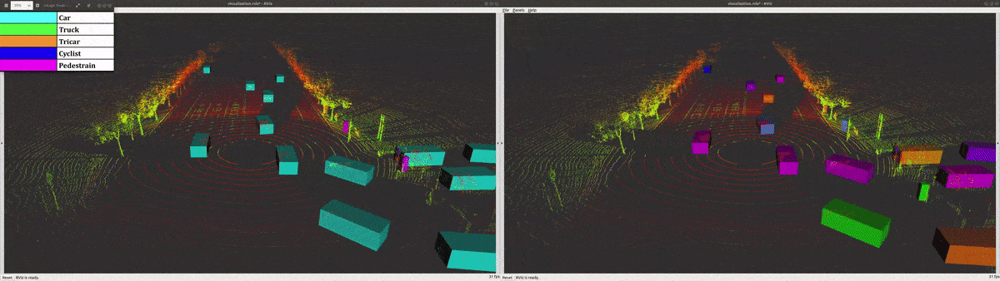
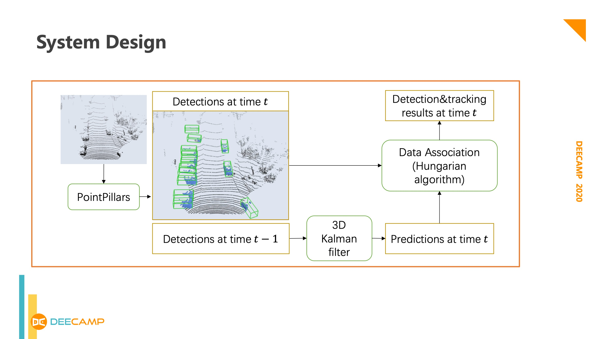
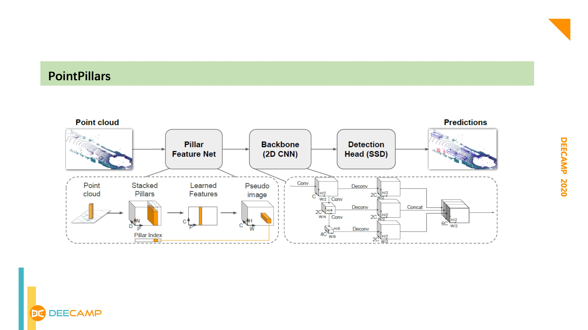
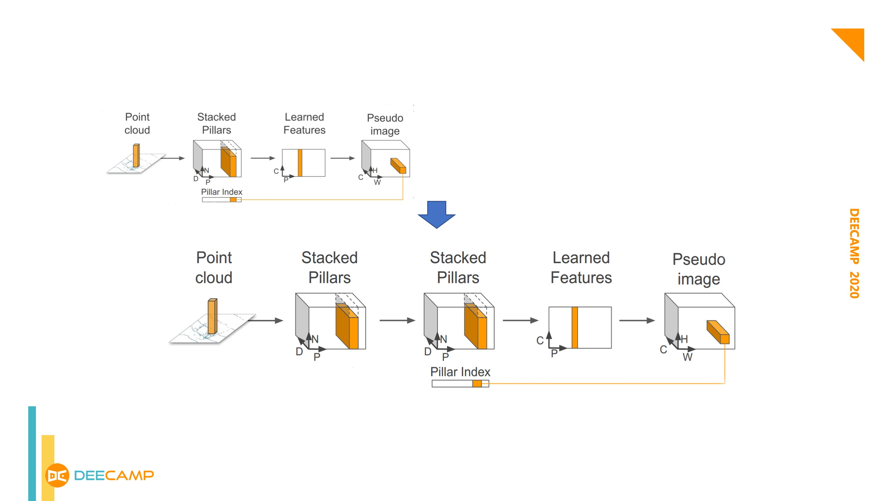
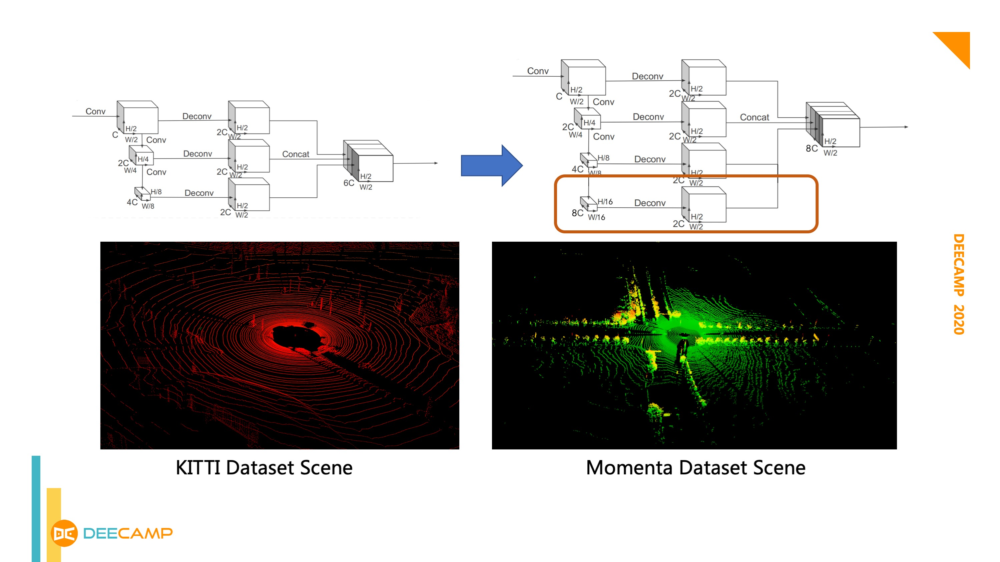
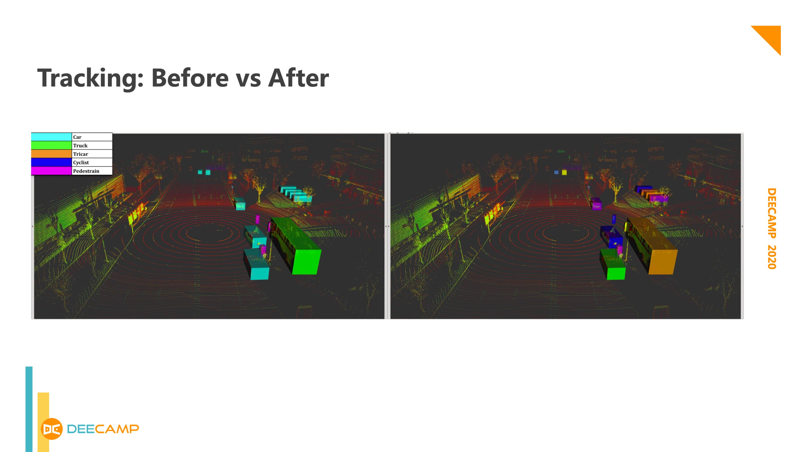

*Skills: Deep Learning, Object Detection & Tracking*

## Overview:

In this project, we developed a 3D object detection and tracking system that can detect cars, buses/trucks, tricars, cyclists, and pedestrians in urban environments with a Velodyne-128 LiDAR. Our detection model achieves 37.8 FPS on 2080Ti.

The video below shows our detection and tracking results on the given dataset.



## System Design

To achieve the required accuracy and frame rate for self-driving applications, we use the PointPillars network for single-frame 3D object detection in the point cloud. Then the system integrates 3D Kalman filter and the Hungarian algorithm for motion prediction and object tracking between multiple frames.

Object detection: Based on the PointPillars network, we modified the network structure to adapt to the Velodyne-128 dataset. The model is then trained and validated on the given dataset.

Object tracking: Given the states of multiple objects in the previous frame, the Kalman filter is used to predict their states in the current frame. The Hungarian algorithm is then used to establish associations between previous and subsequent frames.

## Network Design Details

Since the given Velodyne-128 dataset has more laser beams and larger point clouds than the KITTI dataset, we modified the PointPillars PFN network to a double PFN structure to enhance the network's local feature extraction ability. 

Due to the broader field of view of the Velodyne-128 LiDAR, we also broaden the RPN structure to enhance the detection network’s global feature extraction capability. 

Using the object tracking algorithm, we improve the object detection ability on continuous frames. The figure below shows the comparison before and after object tracking. On the left side, each color represents a class of objects (car, truck, tricar, cyclist, pedestrian). On the right side, each color represents a single object instance tracked by the system.

## Acknowledgment

This project was the teamwork of the DeepLiDAR team with Yunlong Wang, Shao Shan, Xiaoguang Chang, and Feng Xiao at Deecamp 2020. The Velodyne-128 LiDAR dataset is from Momenta.ai.